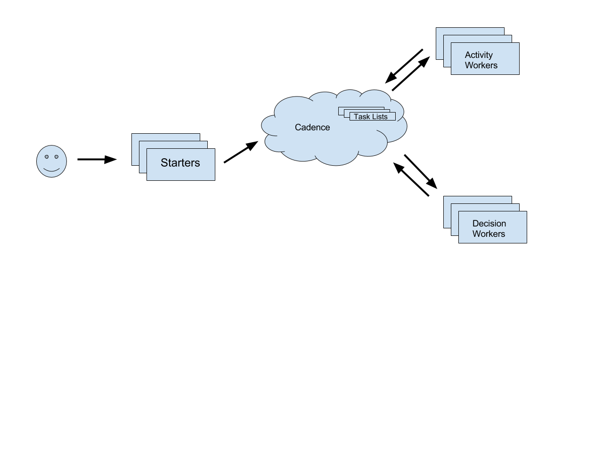
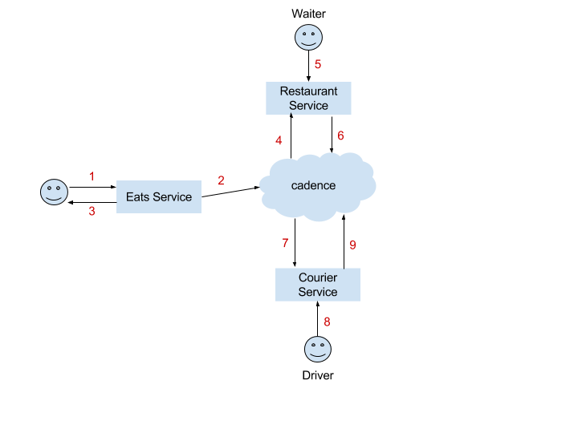

# 

[Codelab Feedback](https://github.com/uber/cadence/issues)


## Introduction


More and more, today's business applications are made up of many loosely coupled microservices, each service responsible for one single task.

Smaller services are simple, reusable, and easy to develop, test, and maintain. For example, consider UberEATS. This application workflow is composed of multiple steps: accepting an EATS order, calling the restaurant, delivering to customer, and handling payment. Some of these steps are asynchronous and can be long running (preparation of food, for example). It's typical to implement each step as its own microservice.

One of the major challenges with developing applications as microservices is implementing coordination logic, responsible for talking with these microservices, dealing with intermittent failures (especially for long running tasks), and managing and propagating state.  

 *Cadence*  is a managed service and a client-side SDK that solves the above problems for developers. In the UberEATS example above, each step could be implemented as a stateless microservice, and Cadence would take care of persistence, fault tolerance, and coordination between steps. With the client-side programming framework, you can author coordination logic like a single threaded program. Cadence manages the distributed logic behind the scenes.


## Codelab Overview


In this codelab, you'll learn the key concepts of Cadence and put them into practice with three coding exercises, increasing difficulty as you continue:

* Part I: Hello world
* Part II: EATS application
* Part III: Cron


## Setup


In this section, you'll install and set up Go, start the server, and clone the repository of code you'll need for this codelab.

### __Ready, set, Go__

To get started, install Go:

    cd /tmp
    wget -O golang.tar.gz https://golang.org/dl/go1.8.3.linux-amd64.tar.gz
    tar -C /usr/local -xzf golang.tar.gz
    rm golang.tar.gz
    cd -

`Set the PATH:`

    mkdir -p $HOME/gocode
    mkdir -p $HOME/gocode/bin
    mkdir -p $HOME/gocode/src
    
    export GOPATH=$HOME/gocode
    export PATH=$PATH:/usr/local/go/bin:$GOPATH/bin
    
    # verify your setup
    $ go version
    go version go1.8.3 darwin/amd64  # or your Go version
    
    $ go env GOPATH
    /Users/venkat/gocode

Install Go dependencies:

    $ cd $GOPATH
    $ go get -u github.com/Masterminds/glide

### __Start the Cadence Server__

Start the Cadence server on a separate terminal on your laptop following the steps below.

Install Docker:

    # mac os
    https://docs.docker.com/docker-for-mac/install/
    
    # debian
    https://docs.docker.com/engine/installation/linux/docker-ce/debian/
    
    # ubuntu
    https://docs.docker.com/engine/installation/linux/docker-ce/ubuntu/
    
    # verify setup
    $ docker --version
    docker version 1.13.0, build 49bf474

Start the server:

$ docker run -it -p 7933:7933 ubercadence/devserver:master

### __Clone the Git repo__

Clone the codelab repository, which contains all you need for this codelab:

    mkdir -p $HOME/gocode/src/github.com/venkat1109
    cd $HOME/gocode/src/github.com/venkat1109
    
    git clone https://github.com/venkat1109/cadence-codelab.git
    # make sure you can build
    make bins

Now you're ready to start coding with Cadence.


## Part I: Hello World


In this first part, you'll build a basic workflow that prints a "Hello, world" message to standard output. This exercise will introduce you to the following Cadence concepts:

* Terminology
* Components of a cadence application
* Workflow and activity registration
* Workflow and activity implementation
* Workflow execution history

### __Terminology__

### __Components of a Cadence App__

An application built on top of Cadence contains three components:  *activity workers* ,  *decision workers* , and * workflow starters* .



In your "Hello, world" application, a workflow starter will start a new "Hello, world" workflow, which schedules a decision task. The decision worker, in turn, picks up the decision task and schedules an activity task. The activity worker prints "hello world" and completes the task, which again causes a decision task to be scheduled. The decision worker marks the task as complete and the workflow completes.

### __Declaration and Registration__

Workflows and activities must be registered with the Cadence client library before a worker can use them. In this section, you'll learn the client library APIs you need to use.

#### __Workflow Declaration__

```
func MyWorkflow(ctx cadence.Context, arg1 type1, arg2...) error
```

* The first parameter to the function is ctx cadence.Context. This is a required parameter for all workflow functions, used by the Cadence client library to pass execution context. All the client library functions that are callable from the workflow functions require this ctx parameter. This context parameter is the same concept as the standard context.Context provided by Go.
* The next parameters are the arguments to your workflow. There are no restrictions on type except that all parameters must be serializable. Do not use channels, functions, variadic, or unsafe pointer as params.
* Workflows cannot return values but can return errors. The error return value indicates an error was encountered during execution and the workflow should be terminated.

#### __Activity Declaration__

```
func MyActivity1(ctx cadence.Context, arg1 type1...)
func MyActivity2(ctx cadence.Context, arg1 type1...)  error
func MyActivity3(ctx cadence.Context, arg1 type1...)  (retval, error)
```

* The first parameter to the function MUST be ctx.Context again.
* There are no restrictions on the arguments except that they be serializable.
* Activities can return void or a result along with error. No restrictions exist on the result type except serializability.

#### __Registration__

```
cadence.RegisterWorkflow(MyWorkflow)
cadence.RegisterActivity(MyActivity)
```

* Registration on the client side is necessary for dispatching tasks to a specific workflow or activity handler.
* It's safe to do the registration inside init() method.

### __Workflow Implementation__

Open helloworld/workflow/workflow.go and paste the following code, an implementation of the HelloWorld workflow.

```
package workflow

import (
   "github.com/venkat1109/cadencelab/helloworld/activity"
   "go.uber.org/zap"
   "time"
   "go.uber.org/cadence"
)

// TaskListName is the name of the task list
// that the decision / activity workers will
// poll for tasks
const TaskListName = "helloWorldTaskList"

// init registers the workflow with the cadence library
// the registration causes the client library to record
// the mapping from the function name to function pointer
// This mapping will be used during task dispatch
func init() {
 cadence.RegisterWorkflow(HelloWorld)
}

// HelloWorld is the implementation of helloworld workflow
// this workflow simply invokes an activity that prints a
// hello world message
func HelloWorld(ctx cadence.Context, name string) error {

 ao := cadence.ActivityOptions{
    ScheduleToStartTimeout: time.Minute,
    StartToCloseTimeout:    time.Minute,
    HeartbeatTimeout:       time.Second * 20,
 }

 ctx = cadence.WithActivityOptions(ctx, ao)

 logger := cadence.GetLogger(ctx)
 logger.Info("Workflow started")

 var helloworldResult string
 future := cadence.ExecuteActivity(ctx, activity.Helloworld, name)
 err := future.Get(ctx, &helloworldResult)
 if err != nil {
    logger.Error("Activity failed.", zap.Error(err))
    return err
 }

 logger.Info("Workflow completed.", zap.String("Result", helloworldResult))
 return nil
}
```

### __Execute Activity API__

Workflows invoke activities through the ExecuteActivity API. In the HelloWorld workflow, the code below invoked the HelloWorld activity.

```
ao := cadence.ActivityOptions{
  ScheduleToCloseTimeout:  time.Minute
  ScheduleToStartTimeout:   time.Minute,
  StartToCloseTimeout:      time.Minute,
  HeartbeatTimeout:         time.Second * 20,
}
ctx = cadence.WithActivityOptions(ctx, ao)
cadence.ExecuteActivity(ctx, activity.Helloworld, name)
```

Let's deconstruct this API here.

#### __Execute Activity__

* The first parameter to the API is a required cadence context parameter.
* The second parameter identifies the activity to be executed. This parameter is either a function pointer or a string representing the fully qualified name of the activity function.
* The next set of parameters is passed as arguments to the activity.

#### __Activity Options__

Activities come with various types of knobs/timeouts *. * These knobs can be configured at activity invocation time through the  *WithActivityOptions*  API. This API takes a Cadence context and an ActivityOptions param and returns a child Cadence context configured with the passed in options. ExecuteActivity then takes the child context instead of the original context.

#### __Activity Timeouts__

Notice in the code above that there are various kinds of timeouts associated with an activity. Cadence guarantees that activities will be executed  *at most once* , so an activity either succeeds or fails with one of these timeouts.

### __Activity Implementation__

The next step will be to implement the HelloWorld activity. Open helloworld/activity/activity.go and paste the following code.

```
package activity

import (
        "context"
        "go.uber.org/cadence"
)

// init registers the activity with the cadence library
func init() {
        cadence.RegisterActivity(Helloworld)
}

// HelloWorld is the implementation helloworld activity
func Helloworld(ctx context.Context, name string) (string, error) {
        logger := cadence.GetActivityLogger(ctx)
        logger.Info("helloworld activity started")
        return "Hello " + name + "!", nil
}
```

### __Workflow Starter__

Next, you need something that triggers the workflow. Starter is the main entry point that kicks off the HelloWorld workflow. Open helloworld/starter.go and paste the code below.

```
package main

import (
        "github.com/venkat1109/cadence-codelab/common"
        "github.com/venkat1109/cadence-codelab/helloworld/workflow"
        "github.com/pborman/uuid"
        "go.uber.org/cadence"
        "time"
)

func main() {
        workflowOptions := cadence.StartWorkflowOptions{
                ID:                              "helloworld_" + uuid.New(),
                TaskList:                        workflow.TaskListName,
                ExecutionStartToCloseTimeout:    time.Minute,
                DecisionTaskStartToCloseTimeout: time.Minute,
        }
     // runtime is a helper routine for this codelab
        runtime := common.NewRuntime()
        runtime.StartWorkflow(workflowOptions, workflow.HelloWorld, "Cadence")
}
```

### __Workers__

Finally, we need to start the activity / decision workers which poll for tasks and execute them. Open helloworld/worker.go and copy/paste the following code. In the real world, the decision / activity workers will run on different hosts and will scale independently

```
package main

import (
        "github.com/venkat1109/cadence-codelab/common"
        "github.com/venkat1109/cadence-codelab/helloworld/workflow"
        "go.uber.org/cadence"
)

func main() {
        runtime := common.NewRuntime()
        // Configure worker options.
        workerOptions := cadence.WorkerOptions{
                MetricsScope: runtime.Scope,
                Logger:       runtime.Logger,
        }
        runtime.StartWorkers(runtime.Config.DomainName, workflow.TaskListName, workerOptions)
        select {}
}
```

### __Run your code__

Congratulations on implementing your first Cadence Workflow ! Let's run your workflow now.

Make sure your have cadence-server docker running before following the steps below.

    # compile your code
    make bins
    
    # open a terminal and start your workers
    # this will start both activity and decision
    # workers in a single process
    ./bins/helloworld_worker
    
    # you should see logs like the following
    2017-07-08T10:32:56.890-0700        INFO        cadence/internal_worker_base.go:131        Started Worker        {"Domain": "cadencelab", "TaskList": "helloWorldTaskList", "WorkerID": "75323@venkat-C02QJ2YUG8WM@helloWorldTaskList", "WorkerType": "DecisionWorker", "RoutineCount": 2}
    2017-07-08T10:32:56.890-0700        INFO        cadence/internal_worker_base.go:131        Started Worker        {"Domain": "cadencelab", "TaskList": "helloWorldTaskList", "WorkerID": "75323@venkat-C02QJ2YUG8WM@helloWorldTaskList", "WorkerType": "ActivityWorker", "RoutineCount": 2}
    
    
    # open a terminal and kick off a new workflow
    ./bins/helloworld_starter
    
    # you should see logs like the following
    2017-07-08T10:44:25.537-0700        INFO        common/util.go:116        Started Workflow        {"WorkflowID": "helloworld_6bd43e3f-8b0f-4185-9019-c79fc3fe56c5", "RunID": "2ffed73a-725e-47ff-a3fb-d433aa257bb2"}
    
    # on the worker, you should see the workflow getting executed
    2017-07-08T10:44:27.692-0700        INFO        activity/activity.go:16        helloworld activity started        {"Domain": "cadencelab", "TaskList": "helloWorldTaskList", "WorkerID": "84241@venkat-C02QJ2YUG8WM@helloWorldTaskList"}
    2017-07-08T10:44:27.712-0700        INFO        workflow/workflow.go:47        Workflow completed.{"Domain": "cadencelab", "TaskList": "helloWorldTaskList", "WorkerID": "84241@venkat-C02QJ2YUG8WM@helloWorldTaskList", "WorkflowType": "code.uber.internal/devexp/cadence-codelab/helloworld/workflow.HelloWorld", "WorkflowID": "helloworld_6bd43e3f-8b0f-4185-9019-c79fc3fe56c5", "RunID": "2ffed73a-725e-47ff-a3fb-d433aa257bb2", "Result": "Hello Cadence!"}

### __Execution History__

History refers to an append log of events (with timestamp) that completely captures the whole execution trace of your application. History includes the decisions taken by your workflow, activities started and completed, all inputs and results. The execution flow of the HelloWorld workflow will look like the following:

    # make bins
    
    # list the completed workflows
    $ ./bins/cli --do cadencelab list
    
    code.uber.internal/devexp/cadence-codelab/helloworld/workflow.HelloWorld, -w helloworld_6bd43e3f-8b0f-4185-9019-c79fc3fe56c5 -r 2ffed73a-725e-47ff-a3fb-d433aa257bb2 [2017-07-08T10:44:25-07:00, 2017-07-08T10:44:27-07:00]
    
    # the previous step prints out the workflow id and run id
    # use that to pretty-print the history now
    $ ./bins/cli --do cadencelab show --wid helloworld_6bd43e3f-8b0f-4185-9019-c79fc3fe56c5 --rid 2ffed73a-725e-47ff-a3fb-d433aa257bb2
    
    1, 2017-07-08T10:44:25-07:00, WorkflowExecutionStarted: (WorkflowType:(Name:code.uber.internal/devexp/cadence-codelab/helloworld/workflow.HelloWorld), TaskList:(Name:helloWorldTaskList), Input:[len=11], ExecutionStartToCloseTimeoutSeconds:60, TaskStartToCloseTimeoutSeconds:60, Identity:84259@venkat-C02QJ2YUG8WM@)
    2, 2017-07-08T10:44:25-07:00, DecisionTaskScheduled: (TaskList:(Name:helloWorldTaskList), StartToCloseTimeoutSeconds:60)
    3, 2017-07-08T10:44:27-07:00, DecisionTaskStarted: (ScheduledEventId:2, Identity:84241@venkat-C02QJ2YUG8WM@helloWorldTaskList, RequestId:edb21c2a-ad7a-4c4e-b678-eb4aa91f603f)
    4, 2017-07-08T10:44:27-07:00, DecisionTaskCompleted: (ExecutionContext:[len=0], ScheduledEventId:2, StartedEventId:3, Identity:84241@venkat-C02QJ2YUG8WM@helloWorldTaskList)
    5, 2017-07-08T10:44:27-07:00, ActivityTaskScheduled: (ActivityId:0, ActivityType:(Name:code.uber.internal/devexp/cadence-codelab/helloworld/activity.Helloworld), TaskList:(Name:helloWorldTaskList), Input:[len=11], ScheduleToCloseTimeoutSeconds:120, ScheduleToStartTimeoutSeconds:60, StartToCloseTimeoutSeconds:60, HeartbeatTimeoutSeconds:20, DecisionTaskCompletedEventId:4)
    6, 2017-07-08T10:44:27-07:00, ActivityTaskStarted: (ScheduledEventId:5, Identity:84241@venkat-C02QJ2YUG8WM@helloWorldTaskList, RequestId:81f21513-0900-481d-bde9-002adcef6563)
    7, 2017-07-08T10:44:27-07:00, ActivityTaskCompleted: (Result_:[len=18], ScheduledEventId:5, StartedEventId:6, Identity:84241@venkat-C02QJ2YUG8WM@helloWorldTaskList)
    8, 2017-07-08T10:44:27-07:00, DecisionTaskScheduled: (TaskList:(Name:helloWorldTaskList), StartToCloseTimeoutSeconds:60)
    9, 2017-07-08T10:44:27-07:00, DecisionTaskStarted: (ScheduledEventId:8, Identity:84241@venkat-C02QJ2YUG8WM@helloWorldTaskList, RequestId:dbf00ef6-9cf3-479a-8c9a-b91715cacc75)
    10, 2017-07-08T10:44:27-07:00, DecisionTaskCompleted: (ExecutionContext:[len=0], ScheduledEventId:8, StartedEventId:9, Identity:84241@venkat-C02QJ2YUG8WM@helloWorldTaskList)
    11, 2017-07-08T10:44:27-07:00, WorkflowExecutionCompleted: (Result_:[len=0], DecisionTaskCompletedEventId:10)

Where

 *DecisionTaskScheduled* : Cadence service enqueues a decision task into the taskList to be executed by the decision worker to determine the next step of execution

 *DecisionTaskStarted: * Worker picked up the decision task from the taskList and reports to the Cadence service that it started the decision task execution

 *DecisionTaskCompleted: * Worker reports the result of the decision to the cadence service. In this case, the decision will be to schedule the HelloWorld activity task. Cadence service enqueues an activity task into the taskList and also updates the history in one single atomic operation.

 *ActivityTaskStarted: * Activity worker picked up the activity task

 *ActivityTaskCompleted: * Activity worker reports the result of the activity

### __Examining History__

Cadence service durably stores the history for up to a pre-defined retention period. Let's use the client cli to examine the history of the workflow that you previously executed

    # make bins
    
    # list the completed workflows
    $ ./bins/cli --do cadencelab list
    
    code.uber.internal/devexp/cadence-codelab/helloworld/workflow.HelloWorld, -w helloworld_6bd43e3f-8b0f-4185-9019-c79fc3fe56c5 -r 2ffed73a-725e-47ff-a3fb-d433aa257bb2 [2017-07-08T10:44:25-07:00, 2017-07-08T10:44:27-07:00]
    
    # the previous step prints out the workflow id and run id
    # use that to pretty-print the history now
    $ ./bins/cli --do cadencelab show --wid helloworld_6bd43e3f-8b0f-4185-9019-c79fc3fe56c5 --rid 2ffed73a-725e-47ff-a3fb-d433aa257bb2
    
    1, 2017-07-08T10:44:25-07:00, WorkflowExecutionStarted: (WorkflowType:(Name:code.uber.internal/devexp/cadence-codelab/helloworld/workflow.HelloWorld), TaskList:(Name:helloWorldTaskList), Input:[len=11], ExecutionStartToCloseTimeoutSeconds:60, TaskStartToCloseTimeoutSeconds:60, Identity:84259@venkat-C02QJ2YUG8WM@)
    2, 2017-07-08T10:44:25-07:00, DecisionTaskScheduled: (TaskList:(Name:helloWorldTaskList), StartToCloseTimeoutSeconds:60)
    3, 2017-07-08T10:44:27-07:00, DecisionTaskStarted: (ScheduledEventId:2, Identity:84241@venkat-C02QJ2YUG8WM@helloWorldTaskList, RequestId:edb21c2a-ad7a-4c4e-b678-eb4aa91f603f)
    4, 2017-07-08T10:44:27-07:00, DecisionTaskCompleted: (ExecutionContext:[len=0], ScheduledEventId:2, StartedEventId:3, Identity:84241@venkat-C02QJ2YUG8WM@helloWorldTaskList)
    5, 2017-07-08T10:44:27-07:00, ActivityTaskScheduled: (ActivityId:0, ActivityType:(Name:code.uber.internal/devexp/cadence-codelab/helloworld/activity.Helloworld), TaskList:(Name:helloWorldTaskList), Input:[len=11], ScheduleToCloseTimeoutSeconds:120, ScheduleToStartTimeoutSeconds:60, StartToCloseTimeoutSeconds:60, HeartbeatTimeoutSeconds:20, DecisionTaskCompletedEventId:4)
    6, 2017-07-08T10:44:27-07:00, ActivityTaskStarted: (ScheduledEventId:5, Identity:84241@venkat-C02QJ2YUG8WM@helloWorldTaskList, RequestId:81f21513-0900-481d-bde9-002adcef6563)
    7, 2017-07-08T10:44:27-07:00, ActivityTaskCompleted: (Result_:[len=18], ScheduledEventId:5, StartedEventId:6, Identity:84241@venkat-C02QJ2YUG8WM@helloWorldTaskList)
    8, 2017-07-08T10:44:27-07:00, DecisionTaskScheduled: (TaskList:(Name:helloWorldTaskList), StartToCloseTimeoutSeconds:60)
    9, 2017-07-08T10:44:27-07:00, DecisionTaskStarted: (ScheduledEventId:8, Identity:84241@venkat-C02QJ2YUG8WM@helloWorldTaskList, RequestId:dbf00ef6-9cf3-479a-8c9a-b91715cacc75)
    10, 2017-07-08T10:44:27-07:00, DecisionTaskCompleted: (ExecutionContext:[len=0], ScheduledEventId:8, StartedEventId:9, Identity:84241@venkat-C02QJ2YUG8WM@helloWorldTaskList)
    11, 2017-07-08T10:44:27-07:00, WorkflowExecutionCompleted: (Result_:[len=0], DecisionTaskCompletedEventId:10)


## Part II: EATS Application


In Part-II of this code lab, you will build an Eats web application that uses Cadence for fulfilling every customer order. On a high level, the Eats application serves a menu to its customers where items can be from one or more restaurants. When a customer places an order, the flow of the application will be as follows:

1. Place order with the restaurant
2. Wait for restaurant to accept or decline order
3. After accept, wait for ready signal from restaurant
4. After ready signal, dispatch a courier to pick up food
5. Wait for courier to accept or decline the trip
6. Wait for restaurant and courier to both confirm that food was picked up
7. Wait for courier to confirm that food was delivered to customer
8. Charge the customer

As you can see, most of the steps in the application are asynchronous / long running and some of them even require human intervention by clicking a button (steps 2, 5, 6). Cadence will be used to coordinate the entire customer order while individual steps will be carried out by micro  services.

### __Eats: Application Architecture__

The Eats application is architected in a service oriented fashion. Following are the services and their responsibilities. All services serve a HTTP endpoint and for simplicity, they are all hosted by the same web server on localhost tcp port 8090.

### __Eats: Request Flow__ 

1. Customer places an order
2. Eats Service starts a Eats Order workflow with a unique orderID
3. Eats Service responds with order placed and continuously refreshes order status
4. Eats Order workflow starts a restaurant order sub-workflow. Sub-workflow places an order with the restaurant and awaits confirmation
5. Waiter confirms acceptance of order
6. Restaurant order workflow waits for food ready signal, then reports completion to cadence
7. Eats Order workflow starts a courier delivery sub-workflow. Sub-workflow schedules a courier and awaits confirmation from driver
8. Driver accepts the trip
9. Courier delivery workflow waits for delivery signal, then reports completion to cadence
10. Eats Order workflow schedules activity to charge customer
11. Order complete

### __Eats: Getting Started__

The source code for the eats application lives inside the folder  *eatsapp. * You will be adding / modifying code to make the application work end-to-end. Here is how the source is organized.

#### __Verify your setup__

Make sure the cadence server docker is up and running before proceeding with these steps.

    # compile the binaries
    $ make bins
    
    # Open a terminal and run the cadence workers
    $ ./bins/eats_worker
    
    # Open another terminal and run the eats webserver
    $ ./bin/eats_server
    
    # Now open a browser and navigate to http://localhost:8090/bistro
    # you should see the frontend UI for the eats application
    # the page has three panes and the heading for each pane
    # tells the service that the pane is for

### __Eats: Starting the order workflow__

The first step in the application is to provide an implementation for  *Place Order * button in the eats UI. This will be HTTP POST handler for the eats service. The implementation will generate an orderID and start a cadence order workflow.

```
# open eatsapp/webserver/service/eats/create.go
# add implementation for startOrderWorkflow() method and
# uncomment the commented import statements

// startOrderWorkflow starts the eats order workflow
func (h *EatsService) startOrderWorkflow(items []string) (*cadence.WorkflowExecution, error) {

        orderID := fmt.Sprintf("EO-USR-JOE-%v", time.Now().Unix())

        workflowOptions := cadence.StartWorkflowOptions{
                ID:                              orderID,
                TaskList:                        cadenceTaskList,
                ExecutionStartToCloseTimeout:    10 * time.Minute,
                DecisionTaskStartToCloseTimeout: 10 * time.Minute,
        }

        return h.client.StartWorkflow(workflowOptions, eats.OrderWorkflow, orderID, items)
}
```

```
# now call the create() method from the eats service http handler
# open eatsapp/webserver/service/eats/http.go
# modify ServeHTTP method as follows

func (h *EatsService) ServeHTTP(w http.ResponseWriter, r *http.Request) {
        switch r.Method {
        case "GET":
                h.show(w, r)
        case "POST":
                h.create(w, r)
        default:
                http.Error(w, "", http.StatusInternalServerError)
                return
        }
}
```

### __Eats: Listing open orders__

The next step in the application is to implement the HTTP GET handler for the eats service. This handler simply lists all the current open orders and their status. To implement this handler, we will use the cadence  *ListOpenWorkflow * API. This is an example for how the application can rely on cadence for visibility into its state

```
# open eatsapp/webserver/service/eats/show.go and replace
# implementation for listOpenWorkflows.
# Examine where this method is called in this file.
# Uncomment the commented import statements

// listOpenWorkflows returns all the open eats order workflows
// created over the past ten hours
func (h *EatsService) listOpenWorkflows() (*s.ListOpenWorkflowExecutionsResponse, error) {

        // list all the open workflows in the past 10 hours
        startTime := time.Now().Add(-10 * time.Hour).UnixNano()
        latestTime := time.Now().Add(time.Minute).UnixNano()

        // convert the workflow function into a fully qualified name
        workflowName := getWorkflowName(eats.OrderWorkflow)

        // list all the eats order workflows during the past 10 hours
        req := s.ListOpenWorkflowExecutionsRequest{
                StartTimeFilter: &s.StartTimeFilter{
                        EarliestTime: &startTime,
                        LatestTime:   &latestTime,
                },
                TypeFilter: &s.WorkflowTypeFilter{
                        Name: &workflowName,
                },
        }
        return h.client.ListOpenWorkflow(&req)
}
```

### __Eats: Child Workflows__

The next step in the code lab will be to implement the eats order workflow. Before we do that, let's learn the concept of  *Child Workflows * as we will be needing them for the next step.

#### __Child Workflows__

Workflows can start other sub-workflows just like how workflows can start activities. When a workflow kicks off another workflow, the newly created workflow is called a child workflow and the original workflow is called the parent workflow. Child workflows are, for the most part, independent workflows, except that the termination / cancellation of a parent workflow will impact the child too. Child workflows are useful for the following reasons:

* Allows for refactoring of complex workflows into a series of small reusable workflows, each of which could be owned by different teams or services. For example, a payment processing workflow could be shared across multiple order workflows
* Because cadence persists all of your application execution state as append only history, modeling a complex application as a long series of activities can result in a large history blob. It's a much more scalable approach to model a complex workflow as a series of child workflows, as each of which will have its own independent history

### __Eats: Child Workflow Execution__

Child workflows are executed just like activities.

```
cwo := cadence.ChildWorkflowOptions{
   WorkflowID:                   "SIMPLE-CHILD-WORKFLOW", // optional
   ExecutionStartToCloseTimeout: time.Minute * 30,
}

// execution returns a future
ctx = cadence.WithChildWorkflowOptions(ctx, cwo)
future := cadence.ExecuteChildWorkflow(ctx, SimpleChildWorkflow, arg1..)

var result string
if err := future.Get(ctx, &result); err != nil {
  cadence.GetLogger(ctx).Error("SimpleChildWorkflow failed.", zap.Error(err))
  return err
}

fmt.Println(result)
```

*  *ChildWorkflowOptions * are similar to  *ActivityOptions * and contains the knobs for the timeouts primarily
*  *ExecuteChildWorkflow * returns a future which can be used to obtain the result of execution asynchronously. Calling future.Get() will block the caller until the result becomes available
* When a parent workflow is cancelled by the user, the child workflow can be canceled or abandoned based on a configurable child policy

For the eats application, we will implement the restaurant and courier order processing as independent child workflows.

### __Eats: Order Workflow__

Next, we will be implementing the missing pieces in the eats order workflow. As a first step, open eatsapp/worker/workflow/eats/workflow.go and read through the workflow code. This is the workflow that you previously started within the Eats HTTP POST handler. Now, the code below will implement  *placeRestaurantOrder* , which is the first step in the workflow:

```
# open eatsapp/worker/workflow/eats/order.go
# replace the contents of the file with the following code

package eats

import (
        "code.uber.internal/devexp/cadence-codelab/eatsapp/worker/workflow/restaurant"
        "go.uber.org/cadence"
        "go.uber.org/zap"
        "time"
)

func placeRestaurantOrder(ctx cadence.Context, orderID string, items []string) (time.Duration, error) {
        execution := cadence.GetWorkflowInfo(ctx).WorkflowExecution

        cwo := cadence.ChildWorkflowOptions{
                // Do not specify WorkflowID if you want cadence to generate a unique ID for child execution
                WorkflowID:                   "PO_" + orderID,
                ExecutionStartToCloseTimeout: time.Minute * 30,
        }

        ctx = cadence.WithChildWorkflowOptions(ctx, cwo)

        var eta time.Duration
        err := cadence.ExecuteChildWorkflow(ctx, restaurant.OrderWorkflow, execution.RunID, orderID, items).Get(ctx, &eta)
        if err != nil {
                cadence.GetLogger(ctx).Error("PlaceOrder failed.", zap.Error(err))
                return 0, err
        }

        return eta, nil
}
```

### __Eats: Workflow Constructs__

The next step in the eats order workflow is  *waitForRestaurant* . In order to implement this, we need to understand the concept of workflow constructs. As you already know, cadence persists the execution state of a workflow in the form of append log of events (history). Every time a decision task (workflow function) needs to be executed, cadence replays the history of events to recover the execution state to where it was before. This approach enables developers to author workflow functions as synchronous, sequential code. However, in order to support safe recovery using replays, there are some invariants around workflow implementations. Specifically, there are two invariants:

The Go language runtime, by design, is nondeterministic. For example, iterating over map is purposefully designed to be random.  *select*  is another example of non-deterministic behavior. In order to work around these, workflow functions MUST adhere to the following rules:

* MUST interact with time only through the functions provided by the library. These are cadence.Now() and cadence.Sleep()
* MUST not create / interact with goroutines directly, but instead use the functions provided by the library - cadence.Go() instead of go, cadence.Channel() instead of chan and cadence.Selector() instead of select
* MUST not iterate over maps using range
* MUST only log via the logger provided by the library - cadence.GetLogger()

In addition,

* MUST be re-entrant i.e. read / manipulate local state only
* MUST interact with external systems only through activities

Finally, it's important to remember that all these restrictions only apply for the workflow definitions, activities can do whatever they want

### __Eats: cadence.Selector()__

cadence.Selector() is the replacement for the go  *select*  keyword, which allows you to block on multiple channels and execute whichever one becomes ready first. If multiple conditions become ready, Go decides to execute one at random, which is a problem for us. With cadence.Selector(), you can block on a cadence.Channel or a cadence.Future. Following is an example of using select with standard Go vs with cadence:

Standard Go:

```
ch1 := make(chan struct{})
ch2 := make(chan struct{})

select {
case <-ch1:
    fmt.Println("received msg from ch1")
case <-ch2:
    fmt.Println("received msg from ch2")
}
```

Same code with cadence.Selector()

```
ch1 := cadence.NewChannel(ctx)
ch2 := cadence.NewChannel(ctx)
selector := cadence.NewSelector(ctx)
var value string
selector.AddReceive(ch1, func(c cadence.Channel, more bool) {
              cadence.Receive(ctx, &value)
              fmt.Println("received msg from ch1")
})
selector.AddReceive(ch2, func(c cadence.Channel, more bool) {
              cadence.Receive(ctx, &value)
              fmt.Println("received msg from ch2")
})
selector.select(ctx)
```

### __Eats: Workflow Signals__

Signal is a mechanism to send a message to a running workflow, just like sending a signal to a running process. The other two ways of sending data to a workflow are through startWorkflow arguments and through the return values from activities. Signals are typically used to communicate async external events of interest to the workflow. Signals are sent to a workflow through the  *SignalWorkflow*  API. They can also be sent through the CLI. The sending of a signal by an entity causes the event to be persisted in the workflow history along with scheduling of a decision task. Following are the properties of signals:

* Signals have a name and there are no restrictions on the message format
* Signals are received by the workflow through a named channel
* Signals do not have to be pre-registered with the service, they appear on the fly
* Signals are part of the execution state and have the same strong durability guarantees

Signals are accessed within a workflow through the  *cadence.GetSignalChannel(ctx, name)*  API, which returns a cadence.Channel object

### __Eats: waitForRestaurant__

The  *waitForRestaurant * method takes an ETA for when the food will be ready and blocks until that estimated time. However, if the food becomes ready before the estimated time, wouldn't it be nicer if we wake up immediately ? This is where we use  *Signals* , the restaurant service will send a signal message to this workflow as soon as the food is prepared. That way, we can sleep until the ETA or wake up early, if we receive a signal.

```
# open eatsapp/worker/workflow/eats/wait.go and replace
# the contents with the following code

package eats

import (
        "errors"
        "go.uber.org/cadence"
        "go.uber.org/zap"
        "time"
)

func waitForRestaurant(ctx cadence.Context, signalName string, eta time.Duration) error {

        // wait until it is time to dispatch a courier
        s := cadence.NewSelector(ctx)

        ctx1, cancel := cadence.WithCancel(ctx)
        etaTimer := cadence.NewTimer(ctx1, eta)
        s.AddFuture(etaTimer, func(f cadence.Future) {
                f.Get(ctx, nil)
        })

        var signalVal string
        signalChan := cadence.GetSignalChannel(ctx, signalName)
        s.AddReceive(signalChan, func(c cadence.Channel, more bool) {
                c.Receive(ctx, &signalVal)
                cancel()
                cadence.GetLogger(ctx).Info("Received order status signal!", zap.String("value", signalVal))
        })
        s.Select(ctx)

        if len(signalVal) > 0 && signalVal != "ORDER_READY" {
                cadence.GetLogger(ctx).Error("Received non-ready signal!", zap.String("Signal", signalVal))
                return errors.New("signalVal")
        }

        return nil
}
```

### __Eats: deliverOrder__

The  *deliverOrder*  method is pretty straightforward. It simply starts a child workflow for dispatching a courier to pick up from the restaurant and deliver to the customer.

```
# open eatsapp/worker/workflow/eats/deliver.go and replace
# the contents with the following code

package eats

import (
        "code.uber.internal/devexp/cadence-codelab/eatsapp/worker/workflow/courier"
        "go.uber.org/cadence"
        "go.uber.org/zap"
        "time"
)

func deliverOrder(ctx cadence.Context, orderID string) error {
        cwo := cadence.ChildWorkflowOptions{
                WorkflowID:                   "DO_" + orderID,
                ExecutionStartToCloseTimeout: time.Minute * 30,
        }
        ctx = cadence.WithChildWorkflowOptions(ctx, cwo)
        err := cadence.ExecuteChildWorkflow(ctx, courier.OrderWorkflow, orderID).Get(ctx, nil)
        if err != nil {
                cadence.GetLogger(ctx).Error("DeliverOrder failed.", zap.Error(err))
                return err
        }

        return nil
}
```

### __Eats: chargeOrder__

The final piece of the eats order workflow is payment. The chargeOrder method below will invoke an activity for charging the customer.

```
# open eatsapp/worker/workflow/eats/charge.go and replace
# contents with the following code

package eats

import (
         "code.uber.internal/devexp/cadence-codelab/eatsapp/worker/activity/eats"
        "go.uber.org/cadence"
        "go.uber.org/zap"
        "time"
)

func chargeOrder(ctx cadence.Context, orderID string) error {

        ao := cadence.ActivityOptions{
                ScheduleToStartTimeout: time.Minute * 5,
                StartToCloseTimeout:    time.Minute * 15,
        }
        ctx = cadence.WithActivityOptions(ctx, ao)
        err := cadence.ExecuteActivity(ctx, eats.ChargeOrderActivity, orderID).Get(ctx, nil)
        if err != nil {
                cadence.GetLogger(ctx).Error("Failed to charge customer", zap.Error(err))
                return err
        }

        return nil
}
```

With this, you have fully implemented the eats order workflow.

### __Eats: Restaurant Order Workflow__

The restaurant order sub-workflow does two things :

1. Places an order with the restaurant
2. Estimates the time it takes to complete the order.

On success, the workflow returns the estimated ETA as the result. Open eatsapp/worker/workflow/restaurant/workflow.go and examine the code for the workflow. The code invokes two activities  *PlaceOrderActivity*  and  *EstimateETAActivity* . We will be implementing these activities next.

### __Eats: Task Tokens and ActivityResultPending__

The  *PlaceOrderActivity*  will make use of a cadence feature called task tokens, which will describe here. Cadence activities, in general, are considered finished, when the method that implements the activity returns. The activity implementation can optionally return an  *error*  to indicate to the framework that the activity failed.

However, in certain cases, it is desirable for an activity to trigger an external process, which then finishes the activity in future. For such cases, returning from the activity method doesn't mean the activity completed. Cadence supports a special error type called  *ErrActivityResultPending*  which indicates to the framework that the activity result is pending. When this error value is returned, the activity typically passes a  *task token*  to some external process, which will then complete this activity. A task token uniquely identifies a cadence activity. When the external process completes, it will report completion to cadence through the  *CompleteActivity(token, result)*  API and the activity will be marked complete.

So, how is this used in Eats ? If you recollect the overall application flow, after an order is placed with the restaurant, the waiter can accept or decline the order. This accept / decline step needs human intervention and the  *PlaceOrderActivity*  cannot actually finish until the human responds with an accept or decline. We call this kind of activity completion as  *Manual Activity Completion* , because it requires a manual step to complete the activity. In this case,  *PlaceOrderActivity*  will pass along the  *taskToken * to the restaurant service, when it places an order. The restaurant service will then report the activity as completed after the waiter accepts or declines the order.

### __Eats: PlaceOrderActivity__

```
# open eatsapp/worker/activity/restaurant/placeOrder.go and
# replace the implementation of PlaceOrderActivity with the
# following code. Also uncomment the commented imports

// PlaceOrderActivity implements of send order activity.
func PlaceOrderActivity(ctx context.Context, wfRunID string, orderID string, items []string) (string, error) {

        logger := cadence.GetActivityLogger(ctx)
        activityInfo := cadence.GetActivityInfo(ctx)

        // register token with external service
        err := sendOrder(wfRunID, orderID, items, string(activityInfo.TaskToken))
        if err != nil {
                logger.Info("Failed to send order.", zap.Error(err))
                return "", err
        }

        // ErrActivityResultPending is returned from activity's execution to indicate the activity is not completed when it returns.
        // activity will be completed asynchronously when Client.CompleteActivity() is called.
        logger.Info("Successfully sent order.", zap.String("Order ID", orderID), zap.Strings("Items", items))
        return "", cadence.ErrActivityResultPending
}
```

If you notice the code above, the activity passes the taskToken as a param in the HTTP POST request sent to the restaurant service. Also, the activity returns ResultPending.

### __Eats: EstimateETAActivity__

The EstimateETAActivity below is a dummy implementation that just returns a fixed value.

```
# open eatsapp/worker/activity/restaurant/estimateETA.go and replace
# contents with the following code

package restaurant

import (
        "context"
        "time"

        "go.uber.org/cadence"
        "go.uber.org/zap"
)

func init() {
        cadence.RegisterActivity(EstimateETAActivity)
}

// EstimateETAActivity implements the estimate eta activity.
func EstimateETAActivity(ctx context.Context, orderID string) (time.Duration, error) {
        time.Sleep(time.Second * 5)
        eta := time.Minute * 20
        cadence.GetActivityLogger(ctx).Info("Computed restaurant ready ETA", zap.Duration("ETA", eta))
        return eta, nil
}
```

### __Eats: Manual Completion__

Next up, let's add the code to manually complete the  *PlaceOrderActivity*  after a restaurant accepts or declines the order. To achieve this, we add an implementation to the HTTP API for the restaurant service. A restaurant that received the order should be able to invoke this http api to mark the order as accepted or declined.

```
# open eatsapp/webserver/service/restaurant/update.go and
# replace the implementation of handleAction() with the
# following code. Also uncomment any commented imports

// handleAction takes the appropriate action
// corresponding to the specified action type
func (h *RestaurantService) handleAction(r *http.Request, order *Order, action string) {
        switch action {
        case "accept":
           // waiter accepted, complete PlaceOrderActivity
                err := h.client.CompleteActivity(order.TaskToken, "ACCEPTED", nil)
                if err != nil {
                        order.Status = OSRejected
                } else {
                        order.Status = OSPreparing
                }

        case "decline":
           // waiter declined, fail PlaceOrderActivity
                h.client.CompleteActivity(order.TaskToken, "REJECTED", errors.New("Order rejected"))
                order.Status = OSRejected

        case "ready":
           // food is ready, send a signal to the eats.OrderWorkflow
                err := h.client.SignalWorkflow(order.ReadySignal.WorkflowID, order.ReadySignal.RunID, order.ID, "ORDER_READY")
                if err != nil {
                        fmt.Printf("%s", err)
                }
                order.Status = OSReady

        case "sent":
           // Courier picked up the food, send a signal to
           // to the courier workflow
                err := h.client.SignalWorkflow(order.PickUpSignal.WorkflowID, order.PickUpSignal.RunID, order.ID, "ORDER_PICKED_UP")
                if err != nil {
                        fmt.Printf("%s", err)
                }
                order.Status = OSSent

        case "p_sig":
           // Courier out for pick up, record context
           // for sending signal later
                order.PickUpSignal = getSignalParams(r)
        }
}
```

Notice above that we complete the activity in response to an "accept" or "decline". Also notice that we signal other workflows on important events i.e when the food is ready before the ETA, we signal the eats workflow to wake up. When the courier picks the food, we signal the courier workflow to proceed with the next step.

### __Eats: Courier Workflow__

The last workflow of the application is the courier order workflow. This sub-workflow is responsible for finding a courier, food pickup and delivery to customer. The workflow executes the following steps in order:

*  *DispatchCourierActivity* : Finds a courier to deliver the food
*  *PickUpOrderActivity* : Notifies the restaurant and waits for the driver to pick up
* Waits for signal from restaurant to confirm courier pick up
* DeliverOrderActivity: Waits for the order to be delivered to customer

The courier workflow, like the other workflows will make use the task token for manual completion. It will also make use of signal to get notified from the restaurant asynchronously. Open eatsapp/worker/workflow/courier/workflow.go and examine the workflow before we proceed with the implementation of activities.

### __Eats: DispatchCourierActivity__

```
# open eatsapp/worker/activity/courier/dispatchCourier.go and
# replace the implementation of DispatchCourierActivity() with
# the following code. Uncomment any commented imports

// DispatchCourierActivity implements the dispatch courier activity.
func DispatchCourierActivity(ctx context.Context, orderID string) (string, error) {
        logger := cadence.GetActivityLogger(ctx)
        activityInfo := cadence.GetActivityInfo(ctx)

        // register token with external service
        err := dispatch(orderID, string(activityInfo.TaskToken))
        if err != nil {
                logger.Info("Failed to send order to courier.", zap.Error(err))
                return "", err
        }

        // ErrActivityResultPending is returned from activity's execution to indicate the activity is not completed when it returns.
        // activity will be completed asynchronously when Client.CompleteActivity() is called.
        logger.Info("Successfully sent order to courier.", zap.String("Order ID", orderID))
        return "", cadence.ErrActivityResultPending
}
```

### __Eats: PickUpOrderActivity__

```
# open eatsapp/worker/activity/courier/pickupOrder.go and
# replace the implementation of PickUpOrderActivity() with
# the following code. Uncomment any commented imports

// PickUpOrderActivity implements the pick-up order activity.
func PickUpOrderActivity(ctx context.Context, execution cadence.WorkflowExecution, orderID string) (string, error) {
        logger := cadence.GetActivityLogger(ctx)

        err := notifyRestaurant(execution, orderID)
        if err != nil {
                logger.Info("Failed to notify restaurant.", zap.Error(err))
                return "", err
        }

        activityInfo := cadence.GetActivityInfo(ctx)

        // register token with courier service
        err = pickup(orderID, string(activityInfo.TaskToken))
        if err != nil {
                logger.Info("Failed to dispatch courier order.", zap.Error(err))
                return "", err
        }

        return "", cadence.ErrActivityResultPending
}
```

### __Eats: waitForRestaurantPickupConfirmation__

This step waits for the restaurant to send us a signal that the courier actually picked up the food.

```
# open eatsapp/worker/workflow/courier/wait.go and replace
# contents with the following code

package courier

import (
        "errors"
        "go.uber.org/cadence"
        "go.uber.org/zap"
)

func waitForRestaurantPickupConfirmation(ctx cadence.Context, signalName string) error {
        // listen for signal from restaurant
        s := cadence.NewSelector(ctx)

        var signalVal string
        signalChan := cadence.GetSignalChannel(ctx, signalName)
        s.AddReceive(signalChan, func(c cadence.Channel, more bool) {
                c.Receive(ctx, &signalVal)
                cadence.GetLogger(ctx).Info("Received order status signal!", zap.String("value", signalVal))
        })
        s.Select(ctx)

        if len(signalVal) > 0 && signalVal != "ORDER_PICKED_UP" {
                cadence.GetLogger(ctx).Error("Recieved wrong signal!", zap.String("Signal", signalVal))
                return errors.New("signalVal")
        }

        return nil
}
```

### __Eats: DeliverOrderActivity__

```
# open eatsapp/worker/activity/courier/deliverOrder.go and
# replace the implementation of DeliverOrderActivity() with
# the following code. Uncomment any commented imports

// DeliverOrderActivity implements the devliver order activity.
func DeliverOrderActivity(ctx context.Context, orderID string) (string, error) {

        logger := cadence.GetActivityLogger(ctx)
        activityInfo := cadence.GetActivityInfo(ctx)

        // register token with external service
        err := deliver(orderID, string(activityInfo.TaskToken))
        if err != nil {
                logger.Info("Failed to dispatch corier order.", zap.Error(err))
                return "", err
        }

        return "", cadence.ErrActivityResultPending
}
```

This activity completes the courier order workflow.

### __Eats: Courier Manual Completion__

The final step will be to implement the manual completion for courier dispatch. This can be done through the HTTP API handlers for the courier service.

```
# open eatsapp/webserver/service/courier/update.go and replace
# the implementation for handleAction with the following code.
# Uncomment any commented imports
// handleAction takes the action corresponding to the specified action type
func (h *CourierService) handleAction(r *http.Request, job *DeliveryJob, action string) {
        switch action {
        case "accept":
                // driver accepted the trip, complete DispatchCourierActivity
                err := h.client.CompleteActivity(job.AcceptTaskToken, djAccepted, nil)
                if err != nil {
                        job.Status = djRejected
                } else {
                        job.Status = djAccepted
                }

        case "decline":
                // driver declined the trip, complete DispatchCourierActivity
                h.client.CompleteActivity(job.AcceptTaskToken, djRejected, errors.New("Order rejected"))
                job.Status = djRejected

        case "picked_up":
                // driver picked up from restaurant, complete PickUpOrderActivity
                err := h.client.CompleteActivity(job.PickupTaskToken, djPickedUp, nil)
                if err != nil {
                        fmt.Printf("%s", err)
                }
                job.Status = djPickedUp
        case "completed":
                // driver delivered the food, complete the DeliverOrderActivity
                err := h.client.CompleteActivity(job.CompletTaskToken, djCompleted, nil)
                if err != nil {
                        fmt.Printf("%s", err)
                }
                job.Status = djCompleted

        case "p_token":
                // record the task token for PickUpOrderActivity
                job.PickupTaskToken = []byte(r.URL.Query().Get("task_token"))

        case "c_token":
                // record the task token for DeliverOrderActivity
                job.CompletTaskToken = []byte(r.URL.Query().Get("task_token"))
        }
}
```

### __Eats: Test your app !__

# compile the binaries

$ make bins

# Open a terminal and run the cadence workers

$ ./bins/eats_worker

# Open another terminal and run the eats webserver

$ ./bin/eats_server

# Now open a browser and navigate to [http://localhost:8090/bistro](http://localhost/bistro)

# you should see the frontend UI for the eats application

# start by selecting an item from the menu and clicking

#  *Place Order*  button


## Part III: Cron Workflow


In Part-III of this code lab, you will implement a Cron workflow that will introduce you to the following advanced concepts:

* Task Routing
* Activity Heartbeating
* ContinueAsNew API

### __Cron: ContinueAsNew__

Workflows like cron that need to rerun periodically could naively be implemented as a big for loop with a sleep where the entire logic of the workflow is inside the body of the for loop. The problem with this approach is that the history for that workflow will keep growing to a point where they reaches size maximum enforced by the service.

ContinueAsNew is the low level construct that enables implementing such workflows without the risk of failures down the road. The operation atomically completes the current execution and starts a new execution of the workflow with the same workflow ID. The new execution will not carry over any history from the old execution. To trigger this behavior, the workflow function should terminate by returning the special ContinueAsNewError error:

```
func CronWorkflow(cadence.Context ctx, value string) error {
    ...
    return cadence.NewContinueAsNewError(ctx, SimpleWorkflow, value)
}
```

The cron workflow use the  *ContinueAsNew*  error return after executing a certain number of jobs to prevent the history from growing indefinitely.

### __Cron: Activity Heartbeating__

For long running activities, like a cron background task, heartbeating is a mechanism to report the task progress to the cadence service periodically. Heartbeats are reported to the cadence service through the  *RecordAcivityHeartbeat * API. Heartbeating is desirable for the following reasons:

* If your activity fails to report progress for more than  *HeartbeatTimeout*  interval, cadence will consider your activity to have failed. For long lived activities, this is desirable to failing the activity on other timeouts, which can be quite large
* If your activity is long lived, it should be able to detect workflow cancellations and exit as soon as possible. When heartbeats are reported, the activity can learn that the workflow is cancelled from the Heartbeat response
* Finally, with heartbeating, the activity can piggy back some data (say, progress so far). This data will be made available to the workflow, when the activity times out

In the cron workflow, the activity started by the workflow will heartbeat to the service every 10 seconds.

### __Cron: Task Routing__

Task routing refers to the routing of activity tasks to activity workers. For certain applications, it is desirable for related activity tasks to be executed by the same host or group. The activity tasks could be sub-tasks of a bigger task. For example, consider the example of a transcoding application, which typically has three steps - download a file, process the file and upload the new file. It will be desirable to implement the three steps as separate activities, but have all of them handled by the same host.

Task routing to a specific entity can be achieved through the use of  *TaskList* . For the media transcoding example, the solution will be to create one taskList per hostname and schedule all activities for a specific file to the same host.  Refer to the following sample for an example implementation of the transcoding use-case:

[https://github.com/samarabbas/cadence-samples/tree/master/cmd/samples/fileprocessing](https://github.com/samarabbas/cadence-samples/tree/master/cmd/samples/fileprocessing)

In the cron workflow, we will be using task routing to direct the activities to different host groups.

### __Cron: Workflow Overview__

Let's say, you are running a service with hosts that belong to different groups or categories. And let's say, you want to run a background job on a pre-defined schedule that needs to be picked up and executed by one host from each group. Can you use cadence for that ? The answer is yes. The cron workflow that you will be building will take as input three parameters:

* Frequency
* Total Count
* List of host groups

It will then schedule one background every  *Frequency*  interval for each one of the host groups in the list. After scheduling  *Total Count*  jobs, the workflow will be marked completed.

### __Cron: Workflow__

Notice the use of ContinueAsNew towards the end of the workflow

```
# open cron/workflow/workflow.go and replace the
# implementation runScheduler() with the following code

// runScheduler runs the cron scheduler
func runScheduler(ctx cadence.Context, activityCtx cadence.Context, schedule *CronSchedule) error {

        var loopCount int

        for schedule.Count > 0 && loopCount < maxJobsPerLoop {

                futures := make([]cadence.Future, len(schedule.Hostgroups))

                for i, hg := range schedule.Hostgroups {
                        // create a child context to route this activity
                        // task to a specific task list
                        childCtx := cadence.WithTaskList(activityCtx, hg)
                        futures[i] = cadence.ExecuteActivity(childCtx, activity.Cron)
                }

                cadence.GetLogger(ctx).Info("Waiting for activities to complete")

                for _, future := range futures {
                        err := future.Get(ctx, nil)
                        if err != nil {
                                cadence.GetLogger(ctx).Error("cron job failed", zap.Error(err))
                        }
                }

                loopCount++
                schedule.Count--
                time.Sleep(schedule.Frequency)
        }

        if schedule.Count == 0 {
                cadence.GetLogger(ctx).Info("Cron workflow completed")
                return nil
        }

        // ContinueAsNew workflow to limit the history size
        ctx = cadence.WithExecutionStartToCloseTimeout(ctx, 24*time.Hour)
        ctx = cadence.WithWorkflowTaskStartToCloseTimeout(ctx, 20*time.Minute)
        return cadence.NewContinueAsNewError(ctx, Cron, schedule)
}
```

### __Cron: Activity__

```
# open cron/activity/activity.go and replace the contents
# of Cron() with the following code

// Cron implements the cron activity
func Cron(ctx context.Context) error {

        stopC := make(chan struct{})
        doneC := make(chan struct{})

        go doWork(stopC, doneC) // run cron task in background

        for {

                time.Sleep(heartbeatInterval)

                // Heartbeat to cadence with an optional
                // status message piggy backed with it
                // if the workflow is cancelled or terminated
                // cadence will set the context to Done
                cadence.RecordActivityHeartbeat(ctx, "status-report-to-workflow")

                if isDone(ctx, doneC) {
                        // activity / workflow is cancelled, return now
                        close(stopC)
                        return ctx.Err()
                }
        }

        return nil
}
```

### __Cron: Start the Workers__

```
# open cron/worker.go and replace the implementation of main()
# notice how we start the activity workers and decision workers
# separately for every task list

func main() {

        runtime := common.NewRuntime()

        // Configure worker options.
        decisionWorkerOptions := cadence.WorkerOptions{
                MetricsScope:          runtime.Scope,
                Logger:                runtime.Logger,
                DisableActivityWorker: true,
        }

        // start decision worker on a separate task list
        runtime.StartWorkers(runtime.Config.DomainName, decisionTaskList, decisionWorkerOptions)

        // now start activity workers for hostgroup1 and hostgroup2
        activityWorkerOptions := cadence.WorkerOptions{
                MetricsScope:          runtime.Scope,
                Logger:                runtime.Logger,
                DisableWorkflowWorker: true,
        }
        runtime.StartWorkers(runtime.Config.DomainName, hostgroup1TaskList, activityWorkerOptions)
        runtime.StartWorkers(runtime.Config.DomainName, hostgroup2TaskList, activityWorkerOptions)

        select {}
}
```

### __Cron: Testing__

    # compile binaries
    $ make bins
    
    # start the workers
    $ ./bins/cron_worker
    
    # start the workflow
    # ./bins/cron_starter


## Where to go from here


Congratulations on completing the code lab !

Checkout our github repos to learn more:

[https://github.com/samarabbas/cadence-samples](https://github.com/samarabbas/cadence-samples)

[https://github.com/uber/cadence](https://github.com/uber/cadence)

[https://github.com/uber-go/cadence-client](https://github.com/uber-go/cadence-client)


